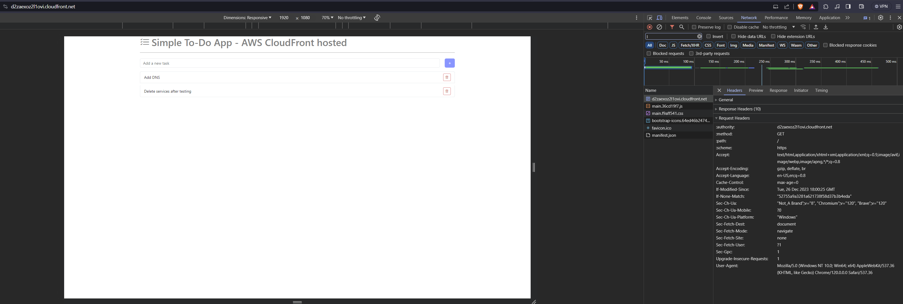
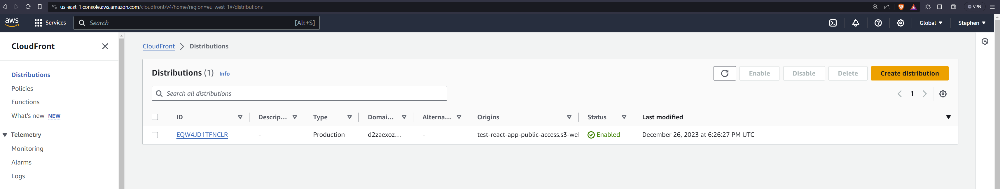

### Simple React demo app

A React demo that runs a simple to-do app. This to-do app is deployed to AWS, distributed using AWS CloudFront. The app has a Github Actions pipeline that runs setup, build, test and deploy jobs.

#### Demo hosted on AWS S3 bucket

#### CloudFront Dashboard

#### Github Actions pipeline

